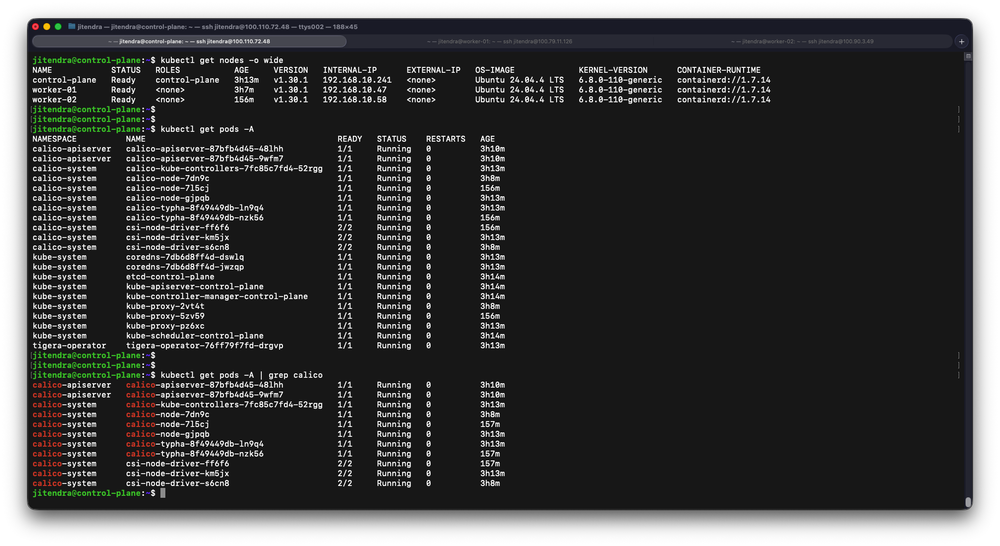

# Kubeadm Installation Guide

This guide outlines the steps needed to set up a Kubernetes cluster using `kubeadm`.

## Prerequisites

- Ubuntu 22.04 LTS or later
- `sudo` privileges
- Internet access
- Minimum recommended resources:
    - 2 vCPU
    - 2 GB RAM

## AWS Setup

1. Ensure all Kubernetes nodes are attached to the same Security Group.
2. Allow inbound traffic on port `6443` in the Security Group to enable worker nodes to join the Kubernetes control plane.
    Reference: https://kubernetes.io/docs/reference/networking/ports-and-protocols/

3. Expose port **22** in the **Security Group** to allows SSH access to manage the instance..


## Configure AWS Security Group

### Step 1: Identify or Create a Security Group

1. **Log in to the AWS Management Console**:
    - Go to the **EC2 Dashboard**.

2. **Locate Security Groups**:
    - In the left menu under **Network & Security**, click on **Security Groups**.

3. **Create a New Security Group**:
    - Click on **Create Security Group**.
    - Provide the following details:
      - **Name**: (e.g., `Kubernetes-Cluster-SG`)
      - **Description**: A brief description for the security group (mandatory)
      - **VPC**: Select the appropriate VPC for your instances (default is acceptable)

4. **Add Rules to the Security Group**:
    - **Allow SSH Traffic (Port 22)**:
      - **Type**: SSH
      - **Port Range**: `22`
      - **Source**: `0.0.0.0/0` (Anywhere) or your specific IP
    
    - **Allow Kubernetes API Traffic (Port 6443)**:
      - **Type**: Custom TCP
      - **Port Range**: `6443`
      - **Source**: `0.0.0.0/0` (Anywhere) or specific IP ranges

5. **Save the Rules**:
    - Click on **Create Security Group** to save the settings.

### Step 2: Select the Security Group While Creating Instances

- When launching EC2 instances:
  - Under **Configure Security Group**, select the existing security group (`Kubernetes-Cluster-SG`)

> Note: Security group settings can be updated later as needed.


## Execute on Both "control-plane" & "worker" Nodes

1. **Disable Swap**: Kubernetes requires swap to be disabled
    ```bash
    sudo swapoff -a
    sudo sed -i '/ swap / s/^\(.*\)$/#\1/g' /etc/fstab
    ```

2. **Load Required Kernel Modules**: Required for Kubernetes networking and container runtime
    ```bash
    # Persist required kernel modules across reboots
    cat <<EOF | sudo tee /etc/modules-load.d/k8s.conf
    overlay
    br_netfilter
    EOF
    # Load kernel modules immediately
    sudo modprobe overlay
    sudo modprobe br_netfilter
    ```
3. **Configure Sysctl Kernel Parameters**: Required for Kubernetes networking
    ```bash
    # Persist Kubernetes networking sysctl settings across reboots
    cat <<EOF | sudo tee /etc/sysctl.d/k8s.conf
    net.bridge.bridge-nf-call-iptables  = 1
    net.bridge.bridge-nf-call-ip6tables = 1
    net.ipv4.ip_forward                 = 1
    EOF
    # Apply sysctl settings immediately
    sudo sysctl --system
    # Verify Kernel Modules
    lsmod | grep br_netfilter
    lsmod | grep overlay
    # Verify Sysctl Parameters
    sysctl net.bridge.bridge-nf-call-iptables
    sysctl net.bridge.bridge-nf-call-ip6tables
    sysctl net.ipv4.ip_forward
    ```
4. **Install and Configure Containerd Runtime**: Containerd is required as the Kubernetes container runtime
    ```bash
    CONTAINERD_VERSION="1.7.14"

    curl -LO https://github.com/containerd/containerd/releases/download/v${CONTAINERD_VERSION}/containerd-${CONTAINERD_VERSION}-linux-amd64.tar.gz
    sudo tar Cxzvf /usr/local containerd-${CONTAINERD_VERSION}-linux-amd64.tar.gz
    curl -LO https://raw.githubusercontent.com/containerd/containerd/main/containerd.service
    sudo mkdir -p /usr/local/lib/systemd/system/
    sudo mv containerd.service /usr/local/lib/systemd/system/
    sudo mkdir -p /etc/containerd
    containerd config default | sudo tee /etc/containerd/config.toml
    sudo sed -i 's/SystemdCgroup = false/SystemdCgroup = true/g' /etc/containerd/config.toml
    sudo systemctl daemon-reload
    sudo systemctl enable --now containerd
    # Verify Containerd Service Status
    sudo systemctl is-active containerd
    ```
5. **Install runc**: runc is the low-level OCI container runtime required by containerd
    ```bash
    RUNC_VERSION="1.1.12"

    curl -LO https://github.com/opencontainers/runc/releases/download/v${RUNC_VERSION}/runc.amd64
    sudo install -m 755 runc.amd64 /usr/local/sbin/runc
    runc --version
    ```
6. **Install CNI Plugins**: Required for Kubernetes pod networking
    ```bash
    CNI_VERSION="1.5.0"

    curl -LO https://github.com/containernetworking/plugins/releases/download/v${CNI_VERSION}/cni-plugins-linux-amd64-v${CNI_VERSION}.tgz
    sudo mkdir -p /opt/cni/bin
    sudo tar Cxzvf /opt/cni/bin cni-plugins-linux-amd64-v${CNI_VERSION}.tgz
    ```
7. **Install Kubernetes Components**: Install kubeadm, kubelet and kubectl
    ```bash
    KUBERNETES_VERSION="1.30.1-1.1"
    KUBERNETES_REPO_VERSION="1.30"

    sudo apt-get update
    sudo apt-get install -y apt-transport-https ca-certificates curl gpg
    curl -fsSL https://pkgs.k8s.io/core:/stable:/v${KUBERNETES_REPO_VERSION}/deb/Release.key | sudo gpg --dearmor -o /etc/apt/keyrings/kubernetes-apt-keyring.gpg
    echo "deb [signed-by=/etc/apt/keyrings/kubernetes-apt-keyring.gpg] https://pkgs.k8s.io/core:/stable:/v${KUBERNETES_REPO_VERSION}/deb/ /" | sudo tee /etc/apt/sources.list.d/kubernetes.list
    sudo apt-get update

    sudo apt-get install -y \
    kubelet=${KUBERNETES_VERSION} \
    kubeadm=${KUBERNETES_VERSION} \
    kubectl=${KUBERNETES_VERSION} \
    --allow-downgrades \
    --allow-change-held-packages

    sudo apt-mark hold kubelet kubeadm kubectl
    kubeadm version
    kubelet --version
    kubectl version --client
    ```
8. **Configure crictl**: Configure crictl to use containerd runtime
    ```bash
    sudo crictl config runtime-endpoint unix:///var/run/containerd/containerd.sock
    ```

## Execute ONLY on the "control-plane" Node

1. **Initialize Kubernetes Control Plane**: 
    ```bash
    POD_NETWORK_CIDR="192.168.0.0/16"
    CONTROL_PLANE_IP="172.31.89.68"
    CONTROL_PLANE_NAME="control-plane"

    sudo kubeadm init \
    --pod-network-cidr=${POD_NETWORK_CIDR} \
    --apiserver-advertise-address=${CONTROL_PLANE_IP} \
    --node-name ${CONTROL_PLANE_NAME}
    ```
2. **Configure kubectl Access**:
    ```bash
    mkdir -p $HOME/.kube
    sudo cp -i /etc/kubernetes/admin.conf $HOME/.kube/config
    sudo chown $(id -u):$(id -g) $HOME/.kube/config
    ```
3. **Install Calico Network Plugin**: Calico provides Kubernetes pod networking 
    ```bash
    CALICO_VERSION="3.28.0"

    kubectl create -f https://raw.githubusercontent.com/projectcalico/calico/v${CALICO_VERSION}/manifests/tigera-operator.yaml
    curl -LO https://raw.githubusercontent.com/projectcalico/calico/v${CALICO_VERSION}/manifests/custom-resources.yaml 
    sed -i "s#192.168.0.0/16#${POD_NETWORK_CIDR}#g" custom-resources.yaml
    kubectl apply -f custom-resources.yaml
    # Restart Container Runtime and Kubelet
    # Reload CNI configuration after Calico installation
    sudo systemctl restart containerd
    sudo systemctl restart kubelet
    ```
4. **Generate Worker Node Join Command**:
    ```bash
    kubeadm token create --print-join-command | tee -a join-command.sh >/dev/null
    ```
## Execute on ALL of your "worker" Nodes

1. **Reset Existing Kubernetes State:**: 
    ```bash
    sudo kubeadm reset -f
    sudo rm -rf /etc/cni/net.d
    sudo rm -rf /var/lib/cni
    sudo rm -rf /var/lib/kubelet
    sudo systemctl restart containerd
    sudo systemctl restart kubelet
    ```
2. **Join Kubernetes Cluster**: Paste the join command you got from the master node and append `--v=5` at the end
    ```bash
    sudo kubeadm join ${CONTROL_PLANE_IP}:6443 \
    --token ${TOKEN} \
    --discovery-token-ca-cert-hash ${DISCOVERY_TOKEN_CA_CERT_HASH} \
    --cri-socket unix:///run/containerd/containerd.sock \
    --v=5
    ```

## Verify Cluster Connection

1. **On On Control-plane Node: Node:**
    ```bash
    kubectl get nodes
    #Kubernetes Troubleshooting Commands
    sudo systemctl status kubelet
    journalctl -u kubelet -xe
    sudo crictl ps -a
    sudo crictl images
    kubectl describe node <node-name>
    kubectl get events -A
    kubectl logs -n kube-system <pod-name>
    ```
2. Kubernetes Cluster Status
    This screenshot shows:
    - Multi-node Kubernetes cluster
    - Control-plane and worker nodes in Ready state
    - Calico CNI running successfully
    - Kubernetes system pods healthy
    <p align="center">
    
    </p>